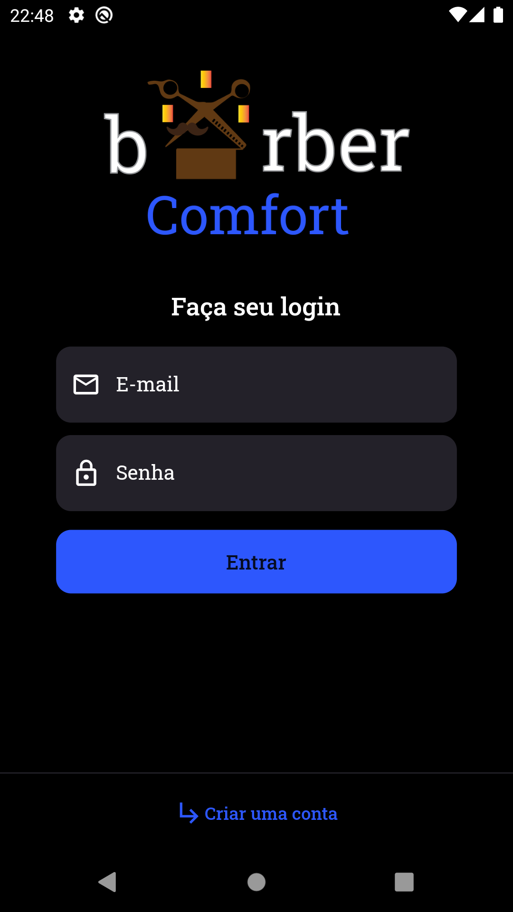
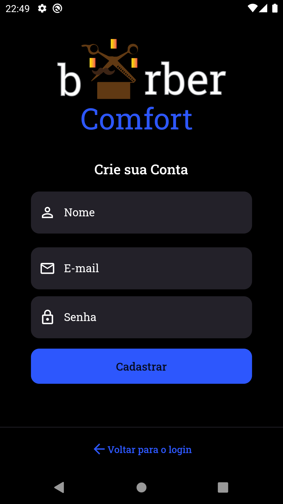
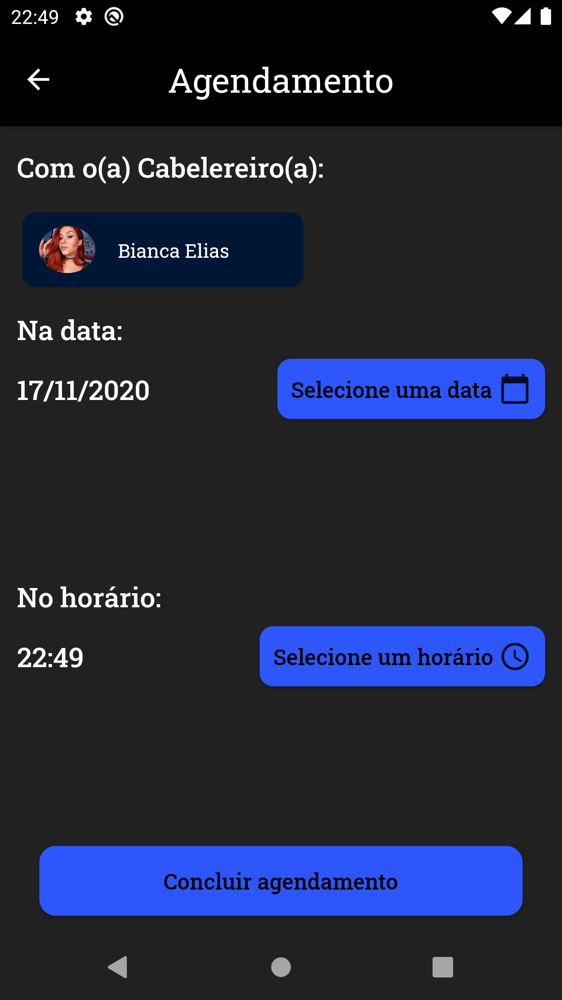
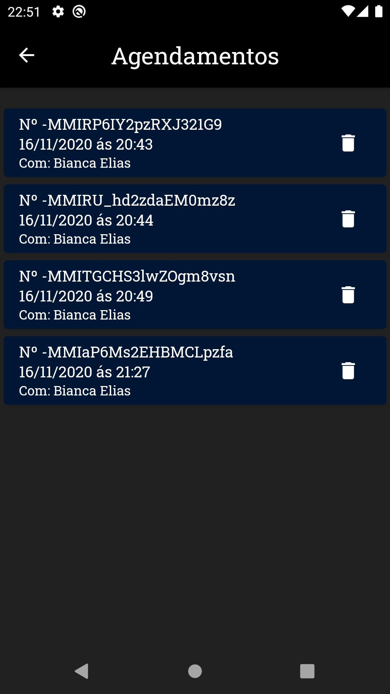

# BarberConfort

Um aplicativo para agendamento com barbeiros cadastrados, construído com a linguagem Dart utilizando o framework Flutter com persistência de dados no Firebase Realtime Database e Sqlite.

## Screen Shots

 
 
 
 
 
 

## Tecnologias usadas

A aplicação possui conexão com o Firebase, especificamente Realtime Database, onde guarda e manipula informações do agendamento. Também é utilizado SQLite guardando informações localmente, toda a autenticação é guardada no dispositivo, portanto se apagar o app ou formatar o celular será necessário criar um novo cadastro.

- Dart
- Flutter 
- Firebase Realtime Database
- SQlite(com a lib SQflite)
- pub packages: email_validator e url_launcher
